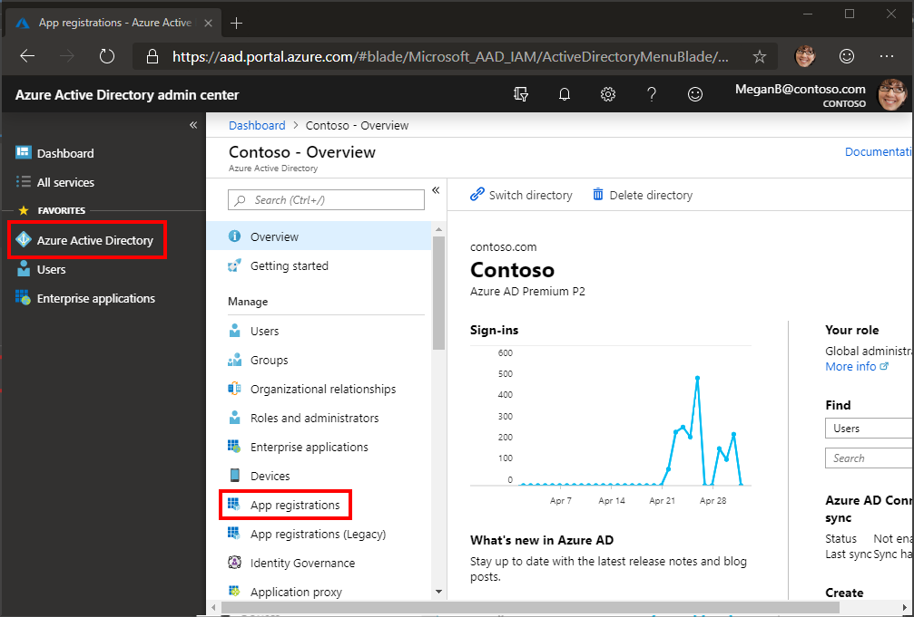

<!-- markdownlint-disable MD002 MD041 -->

この手順では、Azure Active Directory 管理センターを使用して、新しい Azure AD アプリケーションを作成します。In this exercise you will create a new Azure AD application using the Azure Active Directory admin center.

1. ブラウザーを開き、[Azure Active Directory 管理センター](https://aad.portal.azure.com)へ移動して、**個人用アカウント** (別名: Microsoft アカウント)、または**職場/学校アカウント**を使用してログインします。Open a browser and navigate to the [Azure Active Directory admin center](https://aad.portal.azure.com) and login using a **personal account** (aka: Microsoft Account) or **Work or School Account**.

1. 左側のナビゲーションで [ **Azure Active Directory** ] を選択し、[**管理**] の下にある [**アプリの登録**] を選択します。Select **Azure Active Directory** in the left-hand navigation, then select **App registrations** under **Manage**.

    

1. **[新規登録]** を選択します。Select **New registration**. **[アプリケーションを登録]** ページで、次のように値を設定します。On the **Register an application** page, set the values as follows.

    - `.NET Core Graph Tutorial` に **[名前]** を設定します。Set **Name** to `.NET Core Graph Tutorial`.
    - **サポートされているアカウントの種類**を**任意の組織ディレクトリのアカウント**に設定します。Set **Supported account types** to **Accounts in any organizational directory**.
    - **[リダイレクト URI]** を空のままにします。Leave **Redirect URI** empty.

    ![[アプリケーションの登録] ページのスクリーンショット](./images/aad-register-an-app.png)

1. [**登録**] を選択します。Select **Register**. **.Net コアグラフのチュートリアル**ページで、**アプリケーション (クライアント) ID**の値をコピーして保存し、次の手順で必要になります。On the **.NET Core Graph Tutorial** page, copy the value of the **Application (client) ID** and save it, you will need it in the next step.

    

1. [**リダイレクト URI を追加する**] リンクを選択します。Select the **Add a Redirect URI** link. [**リダイレクト uri** ] ページで、[**パブリッククライアント (モバイル、デスクトップ)] セクションの推奨されるリダイレクト uri**を見つけます。On the **Redirect URIs** page, locate the **Suggested Redirect URIs for public clients (mobile, desktop)** section. `https://login.microsoftonline.com/common/oauth2/nativeclient` URI を選択します。Select the `https://login.microsoftonline.com/common/oauth2/nativeclient` URI.

    

1. [**既定のクライアントの種類**] セクションを探し、[アプリケーションを**パブリッククライアントとして扱う**] を [**はい**] に変更して、[**保存**] を選択します。Locate the **Default client type** section and change the **Treat application as a public client** toggle to **Yes**, then choose **Save**.

    ![[既定のクライアントの種類] セクションのスクリーンショット](./images/aad-default-client-type.png)
